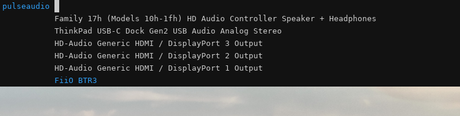

# paswitch



A simple bemenu-based pulseaudio sink switcher menu.

## Usage

```bash
paswitch.py [-h] [--menu MENU] [--prompt PROMPT]
```

Example usage in Sway:
```
set $bemenu bemenu -i -l 15 -m all --tf=#2e9ef4 --hf=#2e9ef4
bindsym $mod+p exec Projects/python-paswitch/paswitch.py -m "$bemenu"
```

## Requirements

- bemenu
- python-pulsectl
